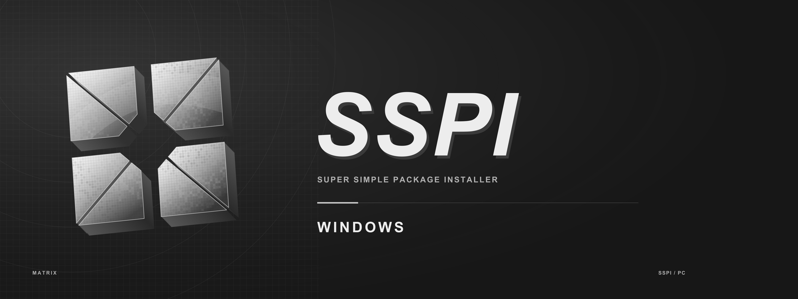
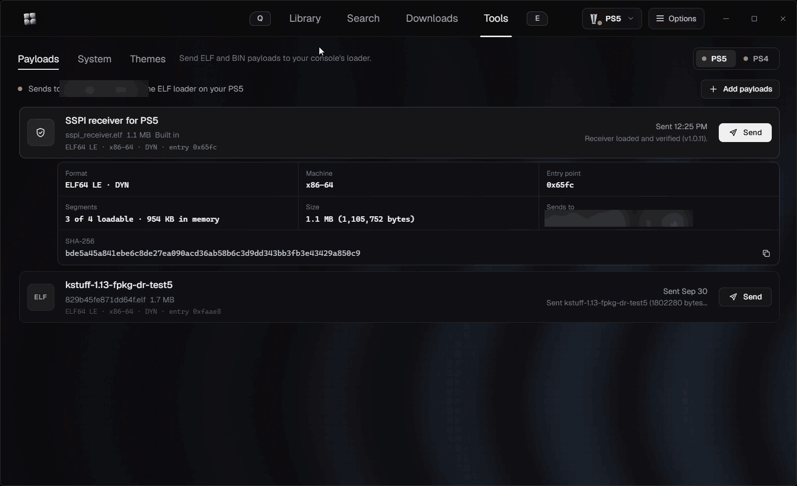

# SSPI Windows Manager

SSPI Windows Manager is the desktop side of SSPI. It finds packages, downloads and extracts them on your PC, turns extracted PS5 dumps into installable packages, and installs the result on a PS5 or PS4 through a small receiver payload. It also looks after the console itself: installed titles and covers, payloads, system information, kernel logs, processes and game icons.



**Version 2.22.0 · Windows 10 and 11 (x64) · Tauri 2, React and Rust**

This is a private development repository. Test builds are published as a single `SSPI.exe` on the [Releases](../../releases) page.

## What it does

**Library**
- Shows the titles installed on each console with their case art, version and required firmware.
- Flags newer updates and queues them from the library.
- Lets you replace any cover with your own image.

**Search and downloads**
- Searches the package sources you install from a `.gssource` file or URL.
- Resolves host links through Real-Debrid, TorBox or AllDebrid. You can also paste links directly or pick files that are already in your debrid account.
- Imports a PKG, scans a folder, or adds extracted game folders from this PC.
- Extracts RAR and ZIP sets, including multipart and old-style `.rar`/`.r00` volumes.
- Tracks every job by stage (download, extract, package, install), with pause, cancel and retry.

**Packaging for PS5**
- Builds a finalized FPKG from an extracted dump, with Kraken compression and PFS v2 or v3.
- Alternatively builds a read-only exFAT image that ShadowMount Plus mounts.
- The dump doctor checks modules and metadata first, and can inspect a dump on its own.
- Package only, without a console, or package and send in one step.

**Delivery**
- **PS5:** the SSPI receiver listens on port 9114 and is loaded through your ELF loader (etaHEN or elfldr, port 9021). Uploads use up to 12 parallel lanes and are verified before AppInst installs them.
- **PS4:** the SSPI PS4 receiver is loaded through GoldHEN BinLoader (port 9090). The PS4 downloads base games and updates from this PC, and DLC is uploaded. Delivery to SSPI PS4's inbox over FTP is also available.
- Both receivers are built into the app, and SSPI tells you when the receiver on a console is out of date.

**Console tools**
- **Payloads:** sends ELF and BIN payloads to the console's loader, including the built-in receivers.
- **System:** shows firmware, model, temperatures, storage and mounts, and reads the kernel log with panic detection plus a live relay from a klog server. It also lists processes with Stop and End, and lists payload logs and crash reports. Everything exports to `.txt` or `.csv`.
- **Game icons:** masks every game's icon to a shape with an optional border, glow or glass, the way Icon Mask does. The originals are kept, and the new icons appear after a restart.
- **Themes (PS4, experimental):** builds a system theme with a wallpaper and replacement system icons.

## Requirements

- Windows 10 or 11 (x64) with the Microsoft Edge WebView2 runtime.
- **PS5:** a console running homebrew with an ELF loader on port 9021, such as etaHEN or elfldr. Packaged installs and ShadowMount images also need compatible homebrew on the console.
- **PS4:** GoldHEN 2.4b18.5 or newer, with BinLoader enabled.
- The PC and the console on the same local network. Allow SSPI through Windows Firewall when asked.
- Packaging dumps needs the .NET 9 runtime and the packaging engine that comes with a full build (see [Releases and updates](#releases-and-updates)).

## Getting started

1. Download `SSPI.exe` from the latest release and run it. It's portable, so nothing is installed.
2. Open **Options → Consoles**, then use **Find consoles** or enter your console's IP address.
3. Load the receiver. Open **Tools → Payloads**, pick your console, and press **Send** next to the SSPI receiver. Load it again after a console restart and after updating SSPI.
4. Install a package source in **Options → Sources**. If your links need it, add a debrid API key in **Options → Debrid**.
5. Choose a download folder with plenty of free space in **Options → Downloads**. For large games, a drive other than the Windows drive is best.
6. Search for a title, or import your own files from **Downloads**.

Want to look around first? Choose **Try the offline preview** on the welcome screen. It simulates consoles, titles and transfers, and nothing is sent anywhere.

## Troubleshooting

| Problem | What to check |
| --- | --- |
| The receiver doesn't answer | Load the receiver that matches this build, then check the console's IP address, the port and Windows Firewall. |
| An install reports a problem, but the game is on the console | Reload the receiver. SSPI waits for it to come back and confirms the install from the console's library. |
| Packaging fails | Read the job's error, run the dump doctor on the folder, and check the free space on the download drive. |
| Search returns nothing | Make sure a package source is installed and enabled in **Options → Sources**. |
| The kernel log is empty or busy | Another payload may hold the kernel log. Use **Live** to stream it from GoldHEN, etaHEN or klogsrv, or open **Logs & crashes**. |

## Status and known limitations

This is development software, tested by a small group. A host build that passes its tests doesn't prove compatibility with every firmware, loader or package.

- PS4 themes install, but the console currently reports themes built by SSPI as corrupted. Leave them alone for now.
- Game icon masks, PS4 kernel log access and the install confirmation after a receiver restart are new in this build and are still being verified on consoles.
- PS5 package installs depend on the console's firmware and loader. When AppInst rejects a package, SSPI shows its error code.

## Releases and updates

Each release currently ships the plain `SSPI.exe`, which covers search, downloads, extraction, installs and the console tools. Packaging dumps (FPKG, exFAT images and Lizard asset packing) and building PS4 themes also need the `resources` folder that sits next to the EXE in a full build.

A Windows installer with automatic updates from this repository is planned. It will install the EXE and its resources together and keep both up to date.

## Building from source

**A plain clone is not a complete build.** This repository holds the application's production source, manifests, lockfiles and license notices. Build scripts, SDKs, the packaging engine, runtime artwork and tests are kept locally and supplied separately.

The full build environment needs:

- Windows with Node.js and npm, and the Rust MSVC toolchain.
- Visual Studio C++ build tools, WebView2, LLVM, Python 3 and the .NET 9 SDK.
- The PS5 payload SDK and the OpenOrbis PS4 toolchain under the ignored `SDK/` folder.

From the product folder in the complete workspace:

```powershell
powershell -NoProfile -ExecutionPolicy Bypass -File .\build.ps1
```

The script builds both receivers, the packaging engine and the application, then writes a timestamped distribution to `../Build-Output/Windows Manager/`.

| Path | Contents |
| --- | --- |
| [`app/src/`](app/src) | React interface: library, search, downloads, tools and options |
| [`app/src-tauri/src/`](app/src-tauri/src) | Rust back end: sources, downloads, archives, packaging, delivery and console tools |
| [`payload/`](payload) | PS5 receiver |
| [`payload-ps4/`](payload-ps4) | PS4 receiver |

## License

Original SSPI code uses the [MIT license](LICENSE). Third-party code, dependencies, artwork and trademarks keep their own terms; see [THIRD_PARTY_NOTICES.md](THIRD_PARTY_NOTICES.md).
